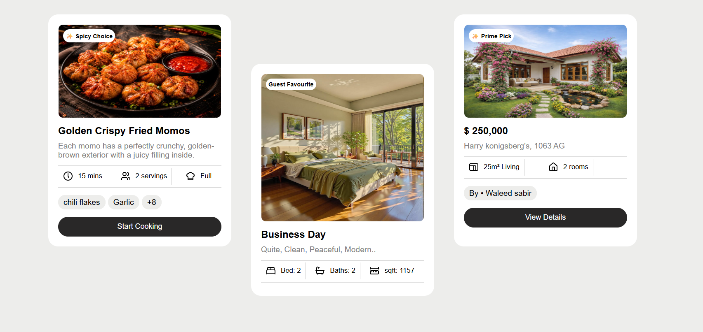

# 🃏 React Reusable Cards

A simple React project demonstrating how to create **reusable card components** using **React Components and Props**.

The same card component can be reused multiple times with different images, titles, and descriptions by passing different data through props.

## ✨ Features

* ♻️ Reusable Card Component
* 🧩 Component-based UI
* 📦 Data passed using Props
* 🖼️ Different images and content for each card
* 🎨 Custom CSS styling
* 📱 Clean and responsive layout

## 💡 Design Inspiration

The card design was inspired by a **vacation/travel booking interface**, including concepts such as travel booking, hotel booking, and vacation cards.

However, the project is **not limited to travel-related content**. The reusable card component can be customized with your own images, titles, descriptions, and other content according to your requirements.


## 🧠 Concepts Practiced

* React Components
* JSX
* Props
* Reusable Components
* `map()` for rendering multiple cards
* CSS Styling

## 🛠️ Tech Stack

* React.js
* JavaScript
* HTML
* CSS
* Vite

## 📸 Preview



## ♻️ How Reusable Is It?

The card component is designed to accept different data through props.

For example:

```jsx
<Card
  image="your-image-url"
  title="Your Title"
  description="Your description"
/>
```

You can replace the content with your own data and reuse the same component for different purposes, such as:

* Travel cards
* Hotel cards
* Product cards
* Blog cards
* Portfolio cards
* Event cards

This allows the same component to be used across different projects without creating a new card component from scratch.

## 🚀 Getting Started

### 1. Clone the repository

```bash
git clone https://github.com/LataMishra15/React-mini-projects.git
```

### 2. Navigate to the project

```bash
cd React-mini-projects/react-reusable-cards
```

### 3. Install dependencies

```bash
npm install
```

### 4. Start the development server

```bash
npm run dev
```

Then open the local development URL shown in the terminal.

## 🎯 Purpose

This project was created as part of my **React learning journey** to understand how components and props can be used to build reusable user interfaces.

The goal was not only to create a card UI, but to understand how a **single reusable component can be customized with different data**.

More React mini-projects will be added to this repository as I continue learning and building. 🚀
